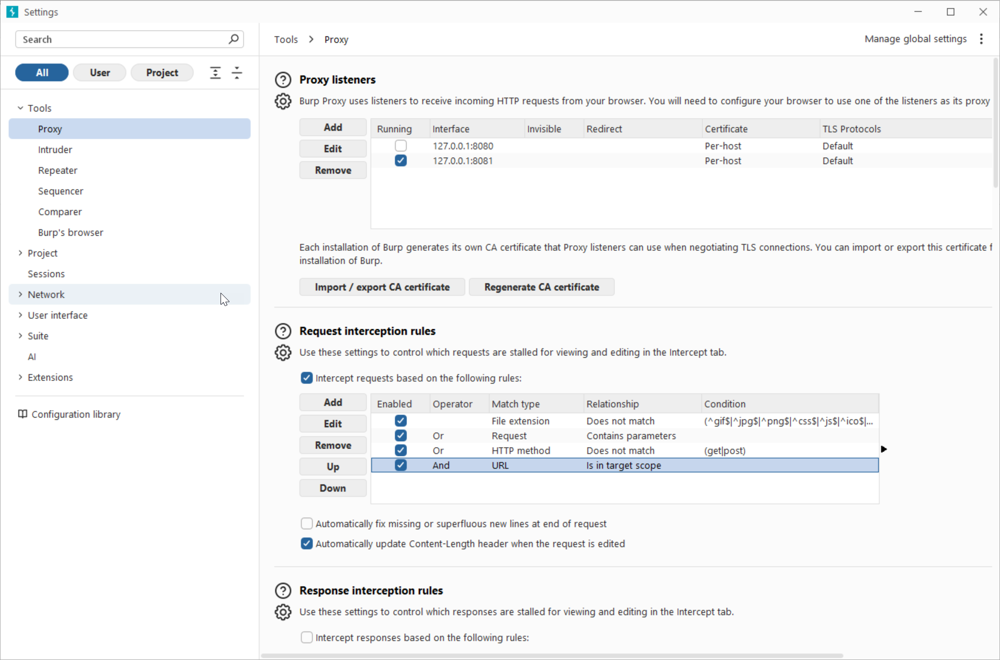
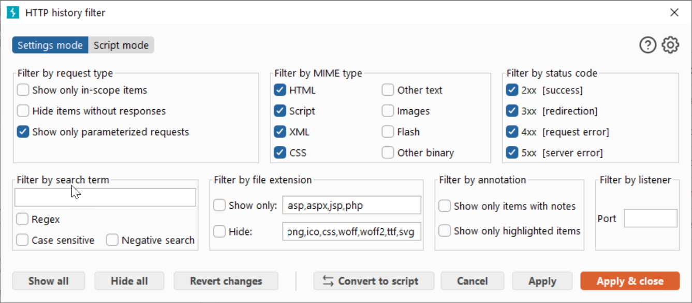

### Exercise: Burb Community Edition

[](A1-Broken Authentication)

###  Prerequisite
1. You have a running AWS EC2 instance.
2. You have running ```webgoat``` container.

### Task
1. Install [https://portswigger.net/burp/releases/professional-community-2026-1-3?requestededition=community&requestedplatform=](Burb Community Edition) on your Notebook
2. Start Burb and select Proxy -> Intercept
3. Set the Proxy according to this screenshot:

[](Burb Proxy Settings)

4. Login to your webgoat instance
5. In WebGoat: Select A1 - Brocken Authentication -> Hijack Session. Read carefully the lesson task.
6. In Burb: Switch to "Intercept on" and "Open browser"
7. In WebGoat: Provide your credentials and press "Access"
8. In Burb: Spot in the sub-tab "HTTP History" the request "http://webgoat.test:8080/WebGoat/HijackSession/login"
9. In Burb: In order to maintain the overview it's advisable to switch the "Filter on" set the filter according to this screenshot: 

[](Burb Filter Settings)


