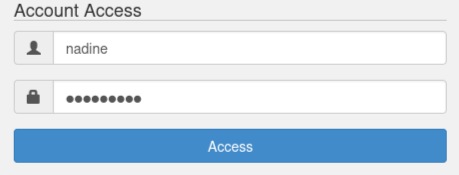
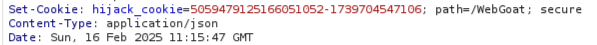
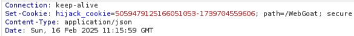
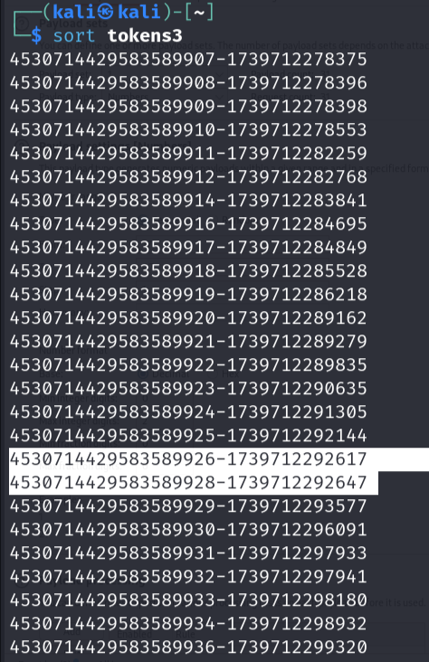
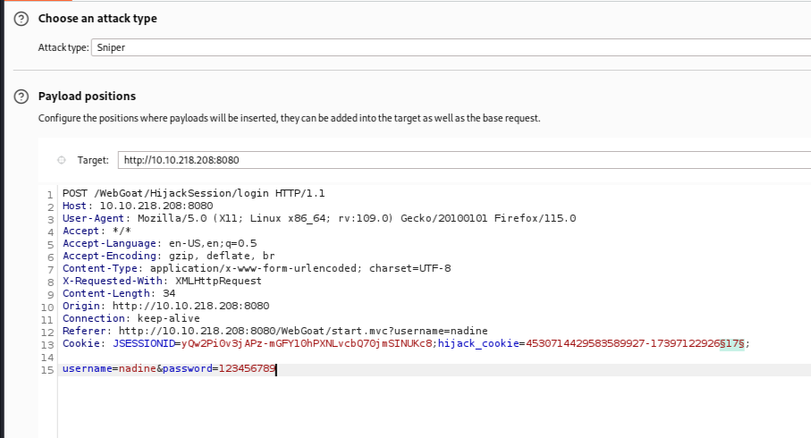
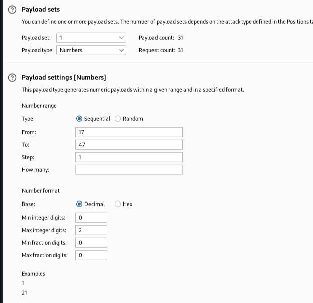
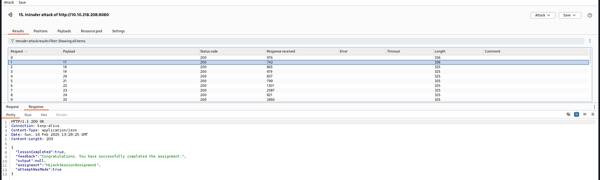
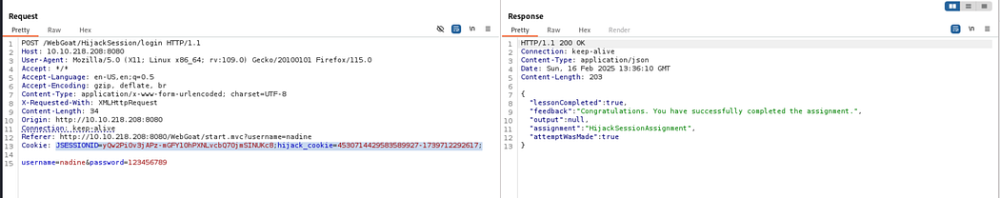
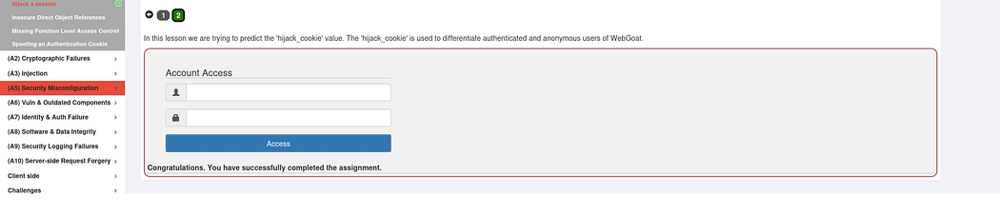

### Exercise: A1 - Brocken Authentication
###  Prerequisite
1. You have a running AWS EC2 instance.
2. You have running ```webgoat``` container.

### Task: Hijack a session
This lesson focuses on the concept of session hijacking, which is a common attack technique used by hackers to gain unauthorized access to a user's session in a web application. Session hijacking can allow an attacker to take over a user's account, gain access to sensitive information, or perform unauthorized actions.

### Goals
**Gain access to an authenticated session belonging to someone else.**

If not already done then open Burp Suite and enable intercept mode. Enter your credentials and clicked **Access**, which allowed me to capture the login request.



Notice that the **hijack cookie** has two distinct parts:

- The first part changed sequentially.
- The second part was based on **epoch time**.






#### What is Epoch Time?

Epoch time (also called **Unix timestamp**) is the number of seconds that have passed since **January 1, 1970** (UTC). It is often used in systems to track time in a simple numeric format. To better understand this, you can use an **epoch converter** to convert timestamps into readable dates and times. [Epoch Converter — Unix Timestamp Converter](https://www.epochconverter.com/)


To analyze the session tokens, use **Burp Suite’s Sequencer**:

1. Sent multiple hijack session tokens to **Burp Sequencer** to check for patterns.
2. Save the captured tokens and sorted them with bash command:

```
cat <tokens_file> | sort 
```



After sorting the session tokens, spot some anomalies in the cookie-pattern For example (see picture above) that **27** **was missing**, meaning it might still be in use. If a session isn’t used, it’s likely still valid.

Since the session token is predictable, use **Burp Intruder** to automate the process:

1. **Send the request to Intruder** and select **Sniper** attack mode.
2. **Place a payload marker** on the hijack session token.
3. **Configure payload settings**:

- Use **sequential numbers** for the first part.
- Adjust the **epoch timestamp** accordingly.

**4. Launch the attack** to test multiple session IDs.







Once a **valid hijack session ID** is found, I injected it into the request and successfully accessed the hijacked session.







Your successfully solved lesson will be highlighted "green".



