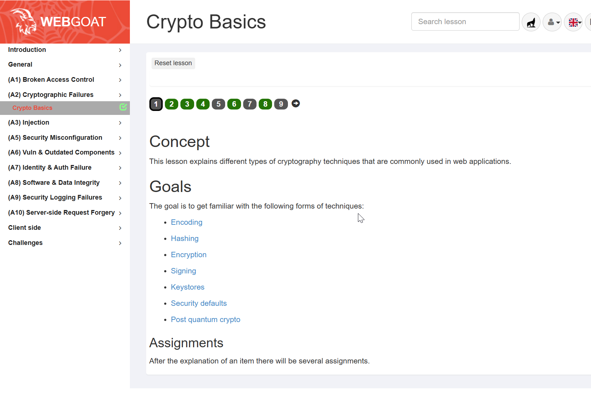

### Exercise: Base64 encoding (Crypto Basics - lesson 2) 

[](Crypto Basics)

###  Prerequisite
1. You have a python runtime version 3.x installed 
2. You have a running AWS EC2 instance.
3. You have running ```webgoat``` container.

### Task 1 - Base64 encoding with Python script
Before you continue your journey on OWASP A2 - Cryptographic Failures
you need some tools in order to progress.

1. As a preparation task fill the gaps to the provided python script ```b64tool.py```.
See therefore the example output of the tool.
2. Decode with b64tool the following string: 
```
U2llIGhhYmVuIGVyZm9sZ3JlaWNoIGRpZSBNZWxkdW5nIGRla29kaWVydCE=
```
3. Decode with b64tool script the assigned lesson

