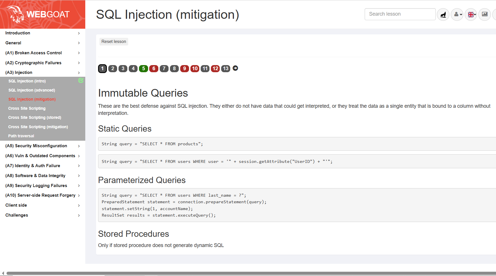

### Exercise: SQL Injection (mitigation) 

[](Sql-Injection Adv)

###  Prerequisite
1. You have a python runtime version 3.x installed 
2. You have a running AWS EC2 instance.
3. You have running ```webgoat``` container


